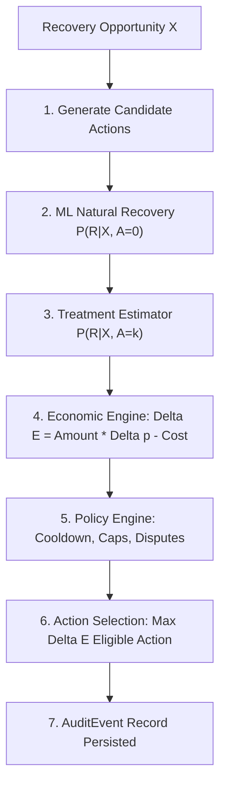

# RecoverAI Economics — Decision Engine Architecture

> **Project**: RecoverAI (Razorpay AI Buildathon Track 03 — AI Revenue Recovery)  

---

## 1. Workflow Sequence

```mermaid
graph TD
    A["Recovery Opportunity X"] --> B["1. Generate Candidate Actions"]
    B --> C["2. ML Natural Recovery P(R|X, A=0)"]
    C --> D["3. Treatment Estimator P(R|X, A=k)"]
    D --> E["4. Economic Engine: Delta E = Amount * Delta p - Cost"]
    E --> F["5. Policy Engine: Cooldown, Caps, Disputes"]
    F --> G["6. Action Selection: Max Delta E Eligible Action"]
    G --> H["7. AuditEvent Record Persisted"]
```
